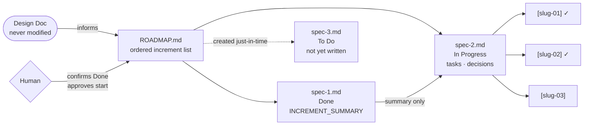

# Dripline

A lightweight, just-in-time context management system for AI-assisted software development. Dripline keeps agents focused, plans flexible, and humans in the loop — by releasing information into context only when it's needed.

---

## The Problem It Solves

The standard approach to AI-assisted development is to produce a single large spec file upfront: requirements, tasks, implementation notes, change log, all of it. This creates several compounding problems:

- **Context bloat.** By mid-project, the agent is ingesting a document full of stale decisions, completed tasks, and early-stage thinking that no longer applies.
- **Rigidity.** A fully pre-written spec commits you to a plan before you've discovered what the plan actually needs to be. When you hit a blocker or change course, the whole document becomes inconsistent.
- **Misaligned intelligence.** The agent is doing formatting and file-creation work at the same time it's supposed to be reasoning about architecture. These are different cognitive loads and shouldn't be collapsed into one step.

Dripline fixes this by separating concerns across time: plan broadly first, then expand each increment into detail only when you're about to start it.

---

## Core Principles

**Just-in-time context.** Information is introduced into the agent's context window at the moment it becomes relevant — not before. Increment specs are written immediately before work begins, not during initial planning.

**Lazy evaluation.** The full tree of work is never materialized upfront. The roadmap describes increments at a high level; the detail lives in spec files that are created one at a time, as needed.

**Vertical slices.** Each increment delivers something testable end-to-end — not a horizontal layer (just the database, just the API). This keeps the project in a verifiable state after every increment and allows genuine reassessment before the next one begins.

**Human gates.** Two transitions require explicit human confirmation: marking an increment Done, and starting a new one. The agent cannot autonomously chain increments together. You verify, then proceed.

**Separation of planning and execution.** Increment planning (reasoning about boundaries, dependencies, sequencing) happens in chat before any files are created. Document creation is a separate, mostly mechanical step. This gives maximum model intelligence to the hard part.

**Reactive by design.** Increment order can change. New increments can be added. Specs are written against the actual state of the codebase at the time they're created, not against assumptions made at project start. The roadmap is a living document, not a contract.

---

## Primitives

**Design doc** — The human-authored brief for the project. Captures goals, user flows, and high-level requirements. Never modified by the agent. The source of truth for intent.

**Roadmap** — `docs/ROADMAP.md`. The ordered list of all increments and their statuses. The agent's entry point for every session. Modified only to update statuses and append increment summaries.

**Increment** — A scope-bounded, independently testable unit of work. Moves through `To Do → In Progress → Done`. Owns one spec. Status transitions require human confirmation.

**Spec** — `docs/specs/[slug].md`. The working document for a single increment. Created just-in-time before work begins. Contains tasks, decisions made during implementation, and an `INCREMENT_SUMMARY` block written on completion.

**Task** — A single actionable item within a spec, identified by a slug-based ID (e.g., `[auth-01]`). Checked off by the agent via grep as work completes. The smallest unit the agent acts on.



Context is released in layers: the roadmap is always available, specs are loaded one at a time as work begins, and completed specs contribute only their `INCREMENT_SUMMARY` — not their full content — to future context.

---

## Document Structure

```
AGENTS.md                  ← minimal; project name + link to ROADMAP.md
docs/
  ROADMAP.md               ← entry point; ordered increment list with statuses
  specs/
    auth-flow.md           ← spec for an increment (created just-in-time)
    dashboard-ui.md
    ...
templates/
  AGENTS.md                ← starter template; copy to project root for new projects
```

### AGENTS.md
Minimal. Its only job is to tell the agent where the entry point is and give a one-line project description. It doesn't describe the workflow — the roadmap's own boilerplate handles that.

A starter template is provided at `templates/AGENTS.md`. Copy it to your project root and fill in the project name and description.

### ROADMAP.md
The entry point for all development work. Contains one entry per increment with these fields:

```markdown
## Increment Name
Status: To Do | In Progress | Done
Spec: docs/specs/[slug].md
Goal: What this increment achieves and why it matters in the system.
Requirements: Hard constraints only. Omit if none.
```

Completed increments also carry a brief summary of decisions and outcomes, appended after the increment entry when the increment is marked Done.

Statuses flow: **To Do → In Progress → Done.**
- The agent may mark an increment In Progress when work begins (with user approval).
- Only the user can confirm Done.

### Spec (docs/specs/[slug].md)
The working document for a single increment. Created just-in-time, immediately before work on that increment begins. Structure:

```markdown
# Increment Name

## Tasks
### Grouping
- [ ] `[slug-01]` Task description

## Decisions
<!-- Choices made during implementation that affect downstream increments. -->

<!-- INCREMENT_SUMMARY -->
<!-- /INCREMENT_SUMMARY -->
```

**Task IDs** (`[slug-01]`, `[slug-02]`, etc.) are derived from the spec filename. They allow the agent to grep directly to a specific task for targeted edits and checkbox updates without ingesting the whole file.

The **Decisions** section captures choices that deviate from the plan or affect downstream increments — not every decision, just the ones that matter.

The **INCREMENT_SUMMARY** block is populated when the user confirms the increment is complete. It serves as a compressed handoff for the agent writing the next spec, so it can pull relevant context without reading the entire completed file.

---

## Workflow

### 1. Initialize the project (`init-dripline`)
Run in your project root. Creates `AGENTS.md` (from the template) if it doesn't exist, or appends the Dripline entry point to an existing one. Creates `docs/` and `docs/specs/` if they don't exist.

### 2. Start a project
Write a design document (also called a PRD, brief, or plan). This captures the soul of the project: goals, user flows, high-level requirements. It is never modified by the agent — it's the source of truth for intent.

### 3. Plan the roadmap (`plan-dripline-roadmap`)
Provide the design doc. The agent reasons through increment boundaries in chat — verbose, thinking out loud, surfacing sequencing tradeoffs. No files are created. You review and adjust.

### 4. Create the roadmap (`create-dripline-roadmap-doc`)
The agent takes the approved plan from chat and produces `docs/ROADMAP.md`. Increment entries are condensed to their tightest accurate form. Spec files are left as stubs.

### 5. Create a spec (`create-dripline-spec`)
With the roadmap in context, the agent reads any completed increment specs for prior decisions, then writes the spec for the next To Do increment. You review before work begins.

### 6. Work the increment
The agent works through tasks top to bottom, checking them off by grepping task IDs. Implementation decisions go in the Decisions section as they're made.

### 7. Confirm and close
You verify the increment works. You tell the agent it's done. The agent writes the INCREMENT_SUMMARY, marks the increment Done in the roadmap. Then you decide whether to proceed to the next increment as planned or reassess.

### 8. Repeat from step 5

---

## Commands

| Command | Input | Output |
|---|---|---|
| `init-dripline` | Project root | `docs/`, `docs/specs/`, `AGENTS.md` |
| `plan-dripline-roadmap` | Design doc | Increment plan in chat for review |
| `create-dripline-roadmap-doc` | Increment plan in context | `docs/ROADMAP.md` |
| `create-dripline-spec` | Roadmap in context | `docs/specs/[slug].md` |

Commands live in `commands/` and are symlinked into `~/cursor/commands/` for global access in Cursor.

### Setup

```bash
git clone <repo> ~/dev/dripline-system
ln -s ~/dev/dripline-system/commands/init-dripline.md ~/cursor/commands/init-dripline.md
ln -s ~/dev/dripline-system/commands/plan-dripline-roadmap.md ~/cursor/commands/plan-dripline-roadmap.md
ln -s ~/dev/dripline-system/commands/create-dripline-roadmap-doc.md ~/cursor/commands/create-dripline-roadmap-doc.md
ln -s ~/dev/dripline-system/commands/create-dripline-spec.md ~/cursor/commands/create-dripline-spec.md
```

Then in each new project, run the `init-dripline` command to scaffold `AGENTS.md` and the `docs/` folder structure.

---

## What Dripline Is Not

- Not a project management tool. It doesn't track time, assign owners, or integrate with external systems.
- Not a rigid methodology. Increment order can shift. Entries can be added mid-project. The system bends without breaking because the commitment granularity is one increment at a time.
- Not autonomous. The agent never chains increments together without your confirmation. You are the gate between every phase of work.

---

## Status

Dripline is in active development. The core workflow is functional but several design problems remain open.

### Open problems

**Context accumulation at scale.** The `create-dripline-spec` command currently instructs the agent to read all completed increment specs before writing the next one. On a long project this is expensive and noisy — most of that content is irrelevant to the increment being planned. The `INCREMENT_SUMMARY` block partially mitigates this (the agent should read summaries, not full files) but the command doesn't enforce this distinction cleanly yet.

Approaches under consideration:
- **Running decisions log** (`docs/DECISIONS.md`): a single append-only file where each increment's closing step distills only the decisions that affect future work. The spec command reads this one file instead of N completed specs.
- **Structured handoff format**: a tighter INCREMENT_SUMMARY schema that makes it machine-readable enough to extract automatically, eventually without human curation.
- **Hybrid**: the running log as the primary context source, with full specs available by reference if the agent needs to dig deeper.

**Automation via hooks.** Several steps in the workflow are mechanical enough to automate — checking off tasks, writing INCREMENT_SUMMARY, updating roadmap status. Cursor hooks (triggered on file save or agent turn completion) may be able to handle some of this. Not yet explored.

**AGENTS.md template.** A reusable starting template for AGENTS.md that correctly bootstraps the workflow in a new project hasn't been written yet.

**Mid-increment course correction.** The system has no explicit protocol for when an agent hits a blocker mid-increment and the spec needs to change. Currently left to the user's judgment. A lightweight convention for amending an in-progress spec would help.
